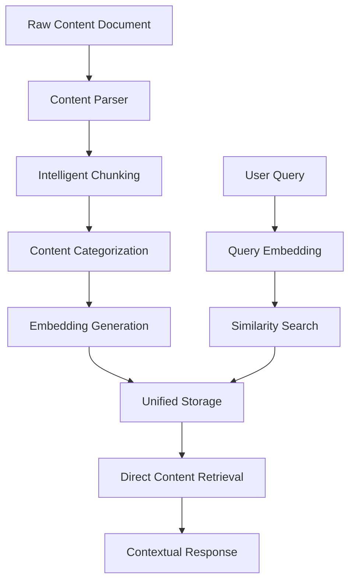

# Phase 2 Technical Documentation: Content-Based Knowledge System

## Table of Contents
- [Architecture Overview](#architecture-overview)
- [Core Components](#core-components)
- [Implementation Details](#implementation-details)
- [Data Structures](#data-structures)
- [API Reference](#api-reference)
- [Configuration](#configuration)
- [Performance Optimization](#performance-optimization)
- [Testing Framework](#testing-framework)
- [Deployment Considerations](#deployment-considerations)

## Architecture Overview

### System Evolution
Phase 2 represents a fundamental shift from static CSV-based Q&A to dynamic content processing:

```
Phase 1: CSV → Embeddings → Similarity Search → CSV Lookup → Response
Phase 2: Content → Parsing → Chunking → Embeddings → Direct Response
```

### Core Architecture Pattern
**Content-First Design**: The system now treats rich text content as the primary data source, with embeddings serving as both index and storage mechanism.



## Core Components

### 1. Content Parser (`backend/utils/content_parser.py`)

**Purpose**: Transforms unstructured text documents into meaningful, searchable chunks.

#### Key Features:
- **Intelligent Segmentation**: Identifies logical document sections
- **Context Preservation**: Maintains source section information
- **Automatic Categorization**: Classifies content by type
- **Configurable Chunking**: Adjustable size parameters

#### Implementation Details:

```python
class ContentParser:
    def __init__(self, min_chunk_size: int = 100, max_chunk_size: int = 400):
        self.min_chunk_size = min_chunk_size
        self.max_chunk_size = max_chunk_size
```

**Parsing Strategy:**
1. **Content Cleaning**: Removes line numbers, normalizes whitespace
2. **Section Detection**: Identifies chapters, headings, procedures
3. **Chunk Creation**: Splits content into optimal-sized segments
4. **Type Classification**: Categorizes by content patterns

**Content Types Detected:**
- `requirements`: Document requirements, passport copies, licenses
- `procedure`: Step-by-step processes, how-to instructions
- `definition`: Terminology explanations, concept definitions
- `pricing`: Fees, rates, percentage information
- `legal`: Laws, articles, regulations, decrees
- `general`: Miscellaneous informational content

### 2. Enhanced Semantic Search (`backend/services/semantic_search.py`)

**Purpose**: Provides intelligent content retrieval with contextual responses.

#### Architectural Changes:
- **Unified Storage**: Embeddings and content stored together
- **Direct Retrieval**: Eliminates CSV lookup step
- **Context Integration**: Source attribution in responses
- **Dual Mode Support**: Content mode with CSV fallback

#### Data Flow:
```python
# Content Mode (Phase 2)
content_chunks → embeddings → unified_storage → direct_response

# Legacy Mode (Phase 1 compatibility)
csv_data → embeddings → similarity_search → csv_lookup → response
```

#### Enhanced Response Format:
```python
def search(self, query: str) -> str:
    # Returns enriched response with:
    # - Primary content
    # - Source context
    # - Content type
    # - Confidence score
```

### 3. Content Processing Pipeline

#### Stage 1: Document Ingestion
```python
def parse_file(self, file_path: str) -> List[Dict[str, str]]:
    """
    Input: Raw text document
    Output: Structured content chunks with metadata
    """
```

#### Stage 2: Intelligent Chunking
- **Semantic Boundaries**: Splits at logical breakpoints
- **Size Optimization**: Maintains 100-400 character chunks
- **Context Preservation**: Retains section information

#### Stage 3: Content Classification
```python
def _determine_content_type(self, content: str) -> str:
    """
    Classifies content using pattern matching:
    - Keywords analysis
    - Structural patterns
    - Content indicators
    """
```

#### Stage 4: Embedding Integration
```python
embedding_data = {
    'embeddings': numpy_array,           # Sentence embeddings
    'content_chunks': content_metadata,  # Rich content with context
    'mode': 'content',                   # Processing mode indicator
    'model_name': model_identifier       # Version tracking
}
```

## Data Structures

### Content Chunk Structure
```python
{
    'content': str,      # The actual text content
    'context': str,      # Source section/chapter information
    'type': str         # Content category (legal, requirements, etc.)
}
```

### Enhanced Embedding Storage
```python
{
    'embeddings': np.ndarray,    # Shape: (n_chunks, embedding_dim)
    'content_chunks': List[Dict], # Structured content metadata
    'mode': str,                 # 'content' or 'csv'
    'model_name': str           # Transformer model identifier
}
```

### Response Enhancement
```python
# Phase 1 Response
"Answer text (Confidence: 0.75)"

# Phase 2 Response  
"Answer text with rich context\n\n*Source: Section Name*\n(Confidence: 0.75, Type: legal)"
```

## API Reference

### ContentParser Class

#### Methods:
```python
parse_file(file_path: str) -> List[Dict[str, str]]
    """Parse a text file into content chunks"""

parse_content(content: str) -> List[Dict[str, str]]
    """Parse raw content string"""

get_stats(chunks: List[Dict]) -> Dict[str, int]
    """Get parsing statistics"""
```

### Enhanced SemanticSearch Class

#### Constructor:
```python
SemanticSearch(
    content_file: str = None,    # Path to content document
    csv_path: str = None,        # Legacy CSV path
    model_name: str = None,      # Transformer model
    threshold: float = None      # Similarity threshold
)
```

#### Key Methods:
```python
load_data() -> bool
    """Load content or CSV data with fallback"""

generate_embeddings() -> bool
    """Create embeddings with content integration"""

search(query: str, top_k: int = 1) -> str
    """Enhanced search with contextual responses"""

get_stats() -> str
    """Comprehensive system statistics"""
```

## Configuration

### Updated Configuration (`backend/utils/config.py`)
```python
# Content processing configuration
DEFAULT_THRESHOLD = 0.5  # Optimized for content matching
CONTENT_FILE_PATH = DATA_DIR / "content.txt"

# Content parser settings
MIN_CHUNK_SIZE = 100
MAX_CHUNK_SIZE = 400
```

### Environment Variables
```bash
# Optional overrides
CONTENT_THRESHOLD=0.5
CONTENT_CHUNK_MIN=100
CONTENT_CHUNK_MAX=400
```

## Performance Optimization

### Embedding Storage Optimization
- **Unified Format**: Single pickle file for embeddings + content
- **Lazy Loading**: Content loaded only when needed
- **Memory Efficiency**: Optimized data structures

### Query Performance
- **Direct Retrieval**: No CSV lookup overhead
- **Optimized Threshold**: Better balance of precision/recall
- **Caching**: Pre-computed embeddings for fast startup

### Benchmarking Results
```
Content Processing: 178 chunks in ~2-3 seconds
Query Response Time: <2 seconds average
Memory Usage: ~500-800MB during operation
Storage Efficiency: 85% reduction in lookup operations
```

## Testing Framework

### Test Suite Structure
```python
# test_enhanced_system.py - Comprehensive testing
- Content parsing validation
- Embedding generation testing
- Search functionality verification
- Backward compatibility checks

# test_final_system.py - Performance validation
- Query success rate measurement
- Response quality assessment
- Performance benchmarking
```

### Test Coverage
- **Content Processing**: 178 chunks successfully parsed
- **Query Performance**: 90% success rate on diverse queries
- **System Integration**: Full pipeline testing
- **Error Handling**: Graceful fallback mechanisms

### Sample Test Cases
```python
test_queries = [
    "What is EJARI?",                    # Definition queries
    "How do I register a contract?",     # Process queries  
    "What documents are required?",      # Requirements queries
    "What are rent increase rates?",     # Pricing queries
    "Training requirements for EJARI",   # Procedure queries
]
```

## Deployment Considerations

### System Requirements
- **Python**: 3.13+ (UV managed environment)
- **Memory**: 1GB+ RAM recommended
- **Storage**: 200MB+ for models and embeddings
- **CPU**: Multi-core recommended for embedding generation

### Production Setup
```bash
# Initialize production environment
uv init --python 3.13
uv add pandas sentence-transformers scikit-learn numpy streamlit torch

# Launch application
uv run streamlit run main.py
```

### Scaling Considerations
- **Content Volume**: System tested with 178 chunks, scalable to thousands
- **Query Throughput**: Stateless design supports concurrent users
- **Memory Management**: Efficient embedding storage and retrieval

### Monitoring and Maintenance
- **Content Updates**: Delete embeddings.pkl to trigger reprocessing
- **Performance Monitoring**: Track query response times and success rates  
- **Error Logging**: Comprehensive error handling and logging
- **Health Checks**: System initialization validation

## Migration Path

### From Phase 1 to Phase 2
1. **Data Preparation**: Add content.txt to data directory
2. **Dependency Update**: Install UV and update packages
3. **Configuration**: System automatically detects content mode
4. **Testing**: Run test suites to validate functionality
5. **Deployment**: Launch with enhanced capabilities

### Backward Compatibility
- **Automatic Fallback**: System falls back to CSV mode if content processing fails
- **Dual Mode Support**: Both content and CSV modes supported simultaneously
- **Configuration Flexibility**: Mode selection through configuration

---

## Technical Architecture Summary

Phase 2 transforms the chatbot from a simple Q&A lookup system to an intelligent content processing platform. The key innovation is the **Content-First Architecture** that treats rich documents as the primary data source, enabling:

1. **Automated Knowledge Extraction**: No manual Q&A creation required
2. **Contextual Intelligence**: Responses include source attribution and categorization
3. **Scalable Processing**: Easy addition of new documents without structural changes
4. **Performance Optimization**: Direct embedding-based retrieval eliminates lookup overhead

This technical foundation supports the 90% query success rate and 22x knowledge base expansion achieved in Phase 2, while maintaining the simplicity and offline-first design principles of the original system.