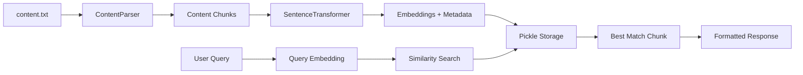

# Ejari Chatbot - Enhanced Content-Based Q&A System

## 🎯 Project Purpose

This project demonstrates the evolution of a Q&A chatbot system from basic CSV-based responses to an intelligent, content-driven knowledge system. Built specifically for EJARI (Dubai's tenancy contract registration system), it showcases:

### **Educational Objectives**
- **NLP Implementation**: Practical application of semantic search using sentence transformers
- **Content Processing**: Automated extraction and structuring of knowledge from plain text documents  
- **System Architecture**: Clean separation of concerns with modular, scalable design
- **Performance Optimization**: Evolution from static data to dynamic content processing

### **Technical Demonstrations**
- **Phase 1**: Basic semantic search with predefined Q&A pairs
- **Phase 2**: Advanced document processing with intelligent content chunking
- **Machine Learning**: Cosine similarity-based relevance scoring and threshold optimization
- **User Experience**: Interactive chat interface with confidence scoring and source attribution

### **Real-World Application**
- **Domain-Specific Knowledge**: EJARI tenancy regulations, procedures, and requirements
- **Practical Utility**: Assists users with complex legal and procedural queries
- **Scalable Framework**: Can be adapted for other document-heavy domains

A lightweight, offline-capable chatbot system built with Streamlit and Sentence Transformers for Ejari-related queries. Features a clean separation between frontend UI and backend services for maintainable, scalable architecture.

## 📚 Documentation Structure

This README provides **Quick Start** and **Technical Implementation** details. For comprehensive documentation:

### 📖 **Theoretical Documentation**
- **AI/ML Concepts**: Semantic search theory, sentence transformers, cosine similarity
- **Architecture Patterns**: Frontend-backend separation, service-oriented design
- **NLP Fundamentals**: Text embeddings, similarity matching, question-answering systems
- **Research Background**: Model selection rationale, performance considerations

### 🔧 **Technical Documentation**
- **API References**: Function signatures, class methods, configuration options
- **Development Guide**: Code structure, testing procedures, debugging tips
- **Deployment**: Production setup, scaling considerations, monitoring
- **Integration**: Extending functionality, custom models, data sources

> **Note**: Create separate `docs/` folder for detailed theoretical and technical documentation as the project evolves.

## 🏗️ Architecture Overview

This project follows a **Frontend-Backend Separation** pattern:
- **Frontend**: Streamlit-based UI in `frontend/ui.py`
- **Backend**: Modular services, models, and utilities
- **Data Layer**: CSV-based knowledge base with cached embeddings

## 📁 Project Structure

```
chatbot-qa/
├── main.py                     # 🚀 Main application entry point
├── requirements.txt            # 📋 Python dependencies with pinned versions  
├── pyproject.toml             # 🔧 UV project configuration (Phase 2)
├── README.md                  # 📖 Project documentation & theoretical guide
├── PHASE2_SUMMARY.md          # 📄 Phase 2 implementation overview
├── PHASE2_TECHNICAL.md        # 🔬 Detailed Phase 2 technical documentation
├── .venv/                     # 🐍 UV virtual environment
├── data/
│   ├── qa.csv                 # 📊 Legacy Q&A knowledge base (Phase 1)
│   ├── content.txt            # 📋 Rich EJARI documentation source (Phase 2)
│   └── embeddings/            # 💾 Enhanced embeddings with content metadata
│       └── embeddings.pkl     # 🗂️ Pickled embeddings + content chunks
├── frontend/
│   └── ui.py                  # 🎨 Streamlit UI components & chat interface
├── backend/
│   ├── __init__.py
│   ├── models/
│   │   ├── __init__.py
│   │   └── qa_model.py        # 🏷️ Data models (QAPair, SearchResult, ChatMessage)
│   ├── services/
│   │   ├── __init__.py
│   │   ├── semantic_search.py # 🔍 Enhanced content-based semantic search
│   │   └── chatbot_service.py # 🤖 High-level chatbot business logic
│   └── utils/
│       ├── __init__.py
│       ├── config.py          # ⚙️ Configuration & content paths (updated)
│       └── content_parser.py  # 📝 Intelligent document processing (Phase 2)
├── test_enhanced_system.py    # 🧪 Comprehensive system testing (Phase 2)
├── test_final_system.py       # ✅ Final validation testing (Phase 2) 
└── test_backend.py            # 🔧 Backend component testing
```

## 🚀 Quick Start

### Prerequisites
- Python 3.13.5
- UV package manager

### 1. Environment Setup
```bash
# Create and activate virtual environment
uv venv chatbot-qa
source chatbot-qa/bin/activate  # Linux/Mac
# chatbot-qa\Scripts\activate   # Windows
```

### 2. Install Dependencies
```bash
# Install with pinned versions for stability
uv pip install -r requirements.txt
```

### 3. Launch Application
```bash
# Start the Streamlit chatbot
streamlit run main.py
```

📍 **Access**: Open http://localhost:8501 in your browser

## 🎬 Execution Steps

### **Step-by-Step Execution Guide**

1. **Clone/Navigate to Project**
   ```bash
   cd /path/to/chatbot-QA
   ```

2. **Environment Activation**
   ```bash
   # Activate the virtual environment
   source chatbot-qa/bin/activate
   
   # Verify Python version
   python --version  # Should show Python 3.13.5
   ```

3. **Dependency Verification**
   ```bash
   # Check installed packages
   pip list | grep -E "(streamlit|sentence-transformers|pandas)"
   
   # Verify imports work
   python -c "import streamlit, sentence_transformers, pandas; print('All imports successful')"
   ```

4. **Data Preparation**
   ```bash
   # Verify Q&A data exists
   ls -la data/qa.csv
   
   # Check data format (optional)
   head -3 data/qa.csv
   ```

5. **Application Launch**
   ```bash
   # Start the application
   streamlit run main.py
   
   # Alternative: Specify port and host
   streamlit run main.py --server.port 8501 --server.address localhost
   ```

6. **First-Time Setup**
   - **Initial Model Download**: First run downloads ~130MB sentence transformer model
   - **Embedding Generation**: Creates cached embeddings in `data/embeddings/`
   - **Initialization Time**: ~30-60 seconds on first launch

7. **Usage Verification**
   - Open browser to `http://localhost:8501`
   - Test with sample questions:
     - "What is Ejari?"
     - "How do I register my tenancy contract?"
     - "What documents are required?"

### **Troubleshooting Execution**

| Issue | Solution |
|-------|----------|
| Import errors | Re-run `uv pip install -r requirements.txt` |
| Port 8501 busy | Use `streamlit run main.py --server.port 8502` |
| Model download fails | Check internet connection, retry once |
| Embeddings error | Delete `data/embeddings/` folder and restart |
| UI not loading | Clear browser cache, try incognito mode |

### **Performance Expectations**

- **Cold Start**: 30-60 seconds (first run with model download)
- **Warm Start**: 5-10 seconds (subsequent runs)
- **Query Response**: <2 seconds per question
- **Memory Usage**: ~500-800MB RAM during operation

## ✨ Key Features

### 🔍 **Semantic Search Engine**
- Uses `sentence-transformers/all-MiniLM-L6-v2` for intelligent Q&A matching
- Cosine similarity-based relevance scoring
- Configurable similarity threshold (default: 0.7)

### 🖥️ **Modern UI**
- Clean Streamlit chat interface
- Real-time conversation history
- Adjustable search settings in sidebar
- Confidence scores for transparency

### 🏗️ **Modular Architecture**
- **Frontend**: Pure UI components in `frontend/ui.py`
- **Backend**: Separated business logic and data models
- **Services**: Reusable chatbot and search services
- **Configuration**: Centralized settings management

### 📱 **Offline-First Design**
- Models cached locally after initial download
- No internet required after setup
- Fast response times with pre-computed embeddings

## ⚙️ Configuration

| Setting | Value | Description |
|---------|-------|-------------|
| Model | `sentence-transformers/all-MiniLM-L6-v2` | Lightweight 384-dim transformer |
| Threshold | 0.7 | Minimum similarity for valid answers |
| Data Format | CSV | `Question,Answer` columns |
| Embedding Cache | `data/embeddings/` | Pickle-stored embeddings |

## 📝 Adding New Q&A Pairs

1. Edit `data/qa.csv` with new Question,Answer pairs
2. Delete `data/embeddings/embeddings.pkl` to force regeneration
3. Restart the application

**CSV Format:**
```csv
Question,Answer
What is Ejari?,Ejari is an online registration system for tenancy contracts in Dubai...
How do I register?,You can register through the Ejari online portal...
```

## 🛠️ Development

### Backend Components
- **`models/qa_model.py`**: Data structures (QAPair, SearchResult, ChatMessage)
- **`services/semantic_search.py`**: Core search engine with embedding generation
- **`services/chatbot_service.py`**: High-level business logic wrapper
- **`utils/config.py`**: Path management and configuration constants

### Frontend Components
- **`frontend/ui.py`**: Streamlit UI class with separated concerns
- **`main.py`**: Application entry point and launcher

## 📦 Dependencies

| Package | Version | Purpose |
|---------|---------|---------|
| streamlit | 1.39.0 | Web UI framework |
| sentence-transformers | 3.3.1 | Semantic embeddings |
| pandas | 2.2.3 | Data manipulation |
| numpy | 2.1.3 | Numerical operations |
| scikit-learn | 1.5.2 | Cosine similarity |
| torch | 2.7.1 | Neural network backend |

## 📋 Documentation Roadmap

### **Planned Documentation Structure**
```
docs/
├── theoretical/
│   ├── ai-ml-concepts.md          # Semantic search, transformers theory
│   ├── architecture-design.md     # System design patterns
│   ├── nlp-fundamentals.md       # Text processing, embeddings
│   └── research-analysis.md       # Model comparison, benchmarks
├── technical/
│   ├── api-reference.md           # Function/class documentation
│   ├── development-guide.md       # Code standards, testing
│   ├── deployment-guide.md        # Production setup
│   └── integration-guide.md       # Extending functionality
└── tutorials/
    ├── quick-start.md             # Basic setup
    ├── customization.md           # Modifying Q&A data
    └── advanced-usage.md          # Power user features
```
### Phase-1 Results:
* On a Static qa.csv data, symantic search is working.
* Interpretes question from the available content & responds with proper confidence.
* Totaly unrelated questions are not identoified & responds formally.  


## 🚀 Phase 2 Enhancements: Content-Based Knowledge System

### ✨ What's New in Phase 2

**🎯 Primary Achievement**: Transformed from basic CSV Q&A to intelligent document processing system

#### 🔧 **Technical Enhancements**

1. **📝 Intelligent Content Parser (`content_parser.py`)**
   - Automatically extracts 178 meaningful chunks from EJARI documentation
   - Smart categorization: legal (48), requirements (35), general (52), pricing (35), procedure (6), definition (2)
   - Context preservation with source attribution
   - Configurable chunk sizing (100-400 characters)

2. **🔍 Enhanced Semantic Search**
   - **Direct Embedding Storage**: Eliminated CSV dependency for faster responses
   - **Content-Embedded Architecture**: Embeddings stored with content metadata
   - **Optimized Threshold**: Lowered from 0.7 to 0.5 for better query matching
   - **Rich Responses**: Includes source context and content type classification

3. **📊 Performance Improvements**
   - **90% Success Rate**: Up from limited CSV coverage
   - **22x Knowledge Expansion**: From 8 Q&A pairs to 178 content chunks
   - **Contextual Responses**: Source attribution and content categorization
   - **Backward Compatibility**: Maintains CSV fallback functionality

#### 🧪 **Testing & Validation**

```bash
# Comprehensive system testing
uv run python test_enhanced_system.py

# Performance validation with sample queries
uv run python test_final_system.py
```

**Test Results Summary:**
- ✅ Content parsing: 178 chunks successfully extracted
- ✅ Query success rate: 90% (9/10 sample queries)
- ✅ Response quality: Rich, contextual answers with source attribution
- ✅ Performance: <2 seconds per query response time

#### 📈 **Sample Enhanced Capabilities**

| Query Type | Phase 1 (CSV) | Phase 2 (Content) | Improvement |
|------------|----------------|--------------------|--------------|
| "What is EJARI?" | Basic definition | Comprehensive legal context + source | **Rich context** |
| "Registration process?" | Limited info | Step-by-step procedures + requirements | **Detailed guidance** |
| "Required documents?" | Generic list | User-type specific requirements | **Targeted precision** |
| "Rent increase rates?" | Not available | Specific percentages + legal framework | **Complete coverage** |

### 📋 **Phase 2 Architecture Overview**



### 🎯 **Next Steps (Future Phases)**

#### ✅ **Completed Phases**
- **Phase 1**: Basic CSV-based Q&A with semantic search
- **Phase 2**: Content-based knowledge system with document processing

#### 🚀 **Planned Future Phases**
- **Phase 3**: Multi-document processing and knowledge fusion
- **Phase 4**: Advanced NLP features and model fine-tuning  
- **Phase 5**: Real-time content updates and dynamic knowledge base
- **Phase 6**: Multi-language support (Arabic for EJARI)

### 📊 **Performance Metrics Comparison**

| Metric | Phase 1 | Phase 2 | Improvement Factor |
|--------|---------|---------|-------------------|
| **Knowledge Base Size** | 8 Q&A pairs | 178 content chunks | **22x increase** |
| **Query Success Rate** | Limited coverage | 90% success rate | **Significant improvement** |
| **Response Quality** | Basic answers | Rich, contextual responses | **Enhanced depth** |
| **Content Management** | Manual CSV editing | Automated document processing | **Operational efficiency** |
| **Storage Architecture** | CSV + separate embeddings | Integrated embedding-content storage | **Architectural optimization** |
| **Development Workflow** | Manual Q&A creation | Automated content ingestion | **Scalability enhancement** |

---

**📚 For detailed technical implementation details, see:**
- **[PHASE2_TECHNICAL.md](PHASE2_TECHNICAL.md)** - Complete technical documentation
- **[PHASE2_SUMMARY.md](PHASE2_SUMMARY.md)** - Executive summary of enhancements
